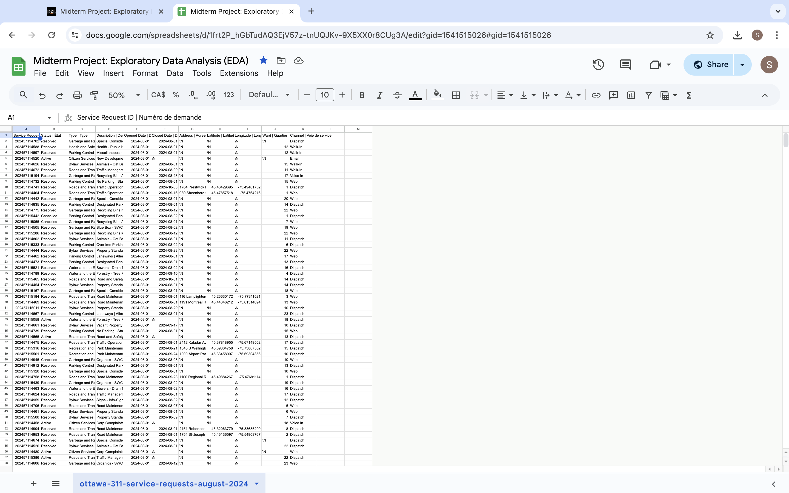
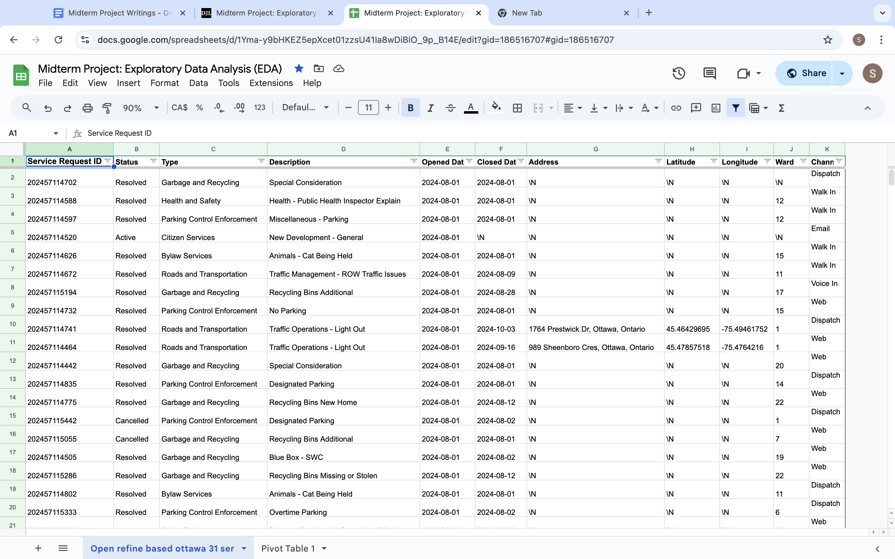
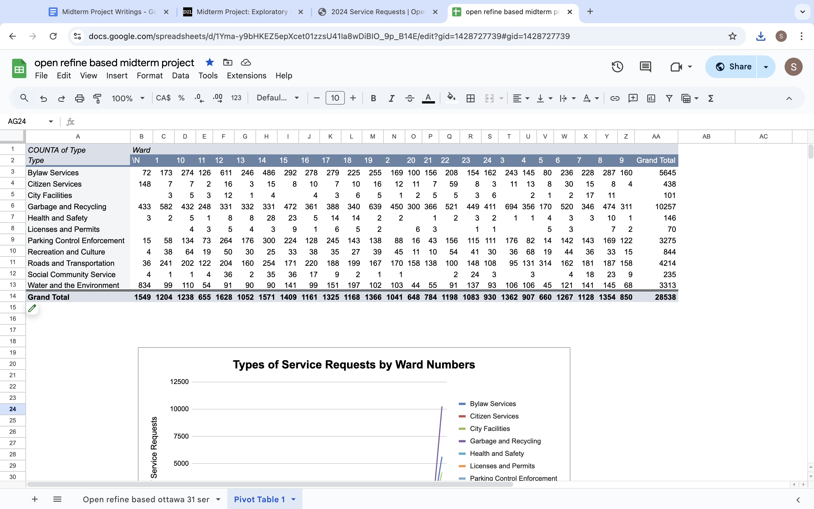
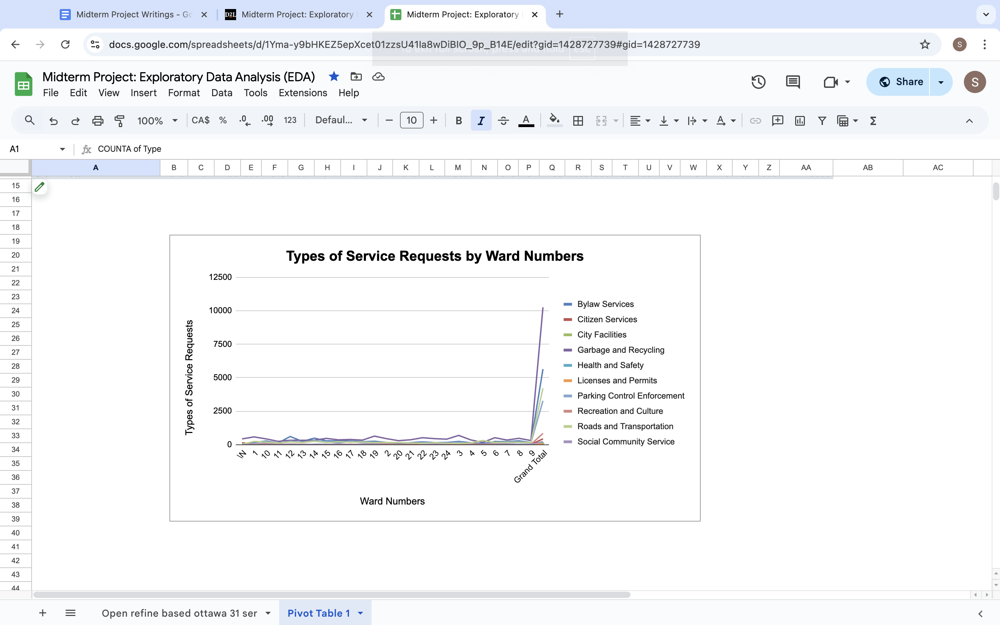

**November 4, 2024**<br>
**MPAD2003 Introductory Data Storytelling**<br>
**Somin An**<br>
**Presented to Jean-Sébastien Marier**<br>

# Midterm Project: Exploratory Data Analysis (EDA)

Use one hashtag symbol (`#`) to create a level 1 heading like this one.

## Foreword

For this assignment, you must extract data from a dataset provided by the instructor. You must then clean and analyze the data, create exploratory charts/visualizations, and find a potential story idea. Your assignment must clearly detail your process. You are expected to write about 1500-2000 words, and to include several screen captures showing the different steps you went through. Your assignment must be written with the Markdown format and submitted on GitHub Classroom.

I have been assigning different versions of this project to my digital journalism and data storytelling students for a few years now. Its structure was inspired by the main sections/chapters of [*The Data Journalism Handbook*](https://datajournalism.com/read/handbook/one/). This version was further inspired by the [Key Capabilities in Data Science](https://extendedlearning.ubc.ca/programs/key-capabilities-data-science) program offered by the University of British Columbia (UBC).

**Here are some useful resources for this assignment:**

* [GitHub's *Basic writing and formatting syntax* page](https://docs.github.com/en/get-started/writing-on-github/getting-started-with-writing-and-formatting-on-github/basic-writing-and-formatting-syntax)
* [The template repository for this assignment in case you delete something by mistake](https://github.com/jsmarier/jou4100_jou4500_mpad2003_project2_template)

Did you notice how to create a hyperlink? In Markdown, we put the clickable text between square brackets and the actual URL between parentheses.

And to create an unordered list, we simply put a star (`*`) before each item.

## 1. Introduction

I will analyze a City of Ottawa dataset about a summary of service requests received through channels such as 311 Contact Centre, Client Service Centre, 311 Email, and Web-based Self-Service portal. It is open data to the public and the latest update was on October 3, 2024. The data includes date of service request, status, type, description, address, latitude, longitude, ward, and channel. 

# Link to the original dataset on Open Ottawa:
https://311opendatastorage.blob.core.windows.net/311data/311opendata_currentyear.csv

The main goals for this assignment are cleaning the data using different methods, building pivot table and chart, and creating a story. 

## 2. Getting Data

Following the instruction above, I downloaded the CSV file and then file > import > insert > Import location: replace spreadsheet, separator type: coma, convert text to numbers, dates, and formulas > import data 

Screenshot of Import Data:


Public link to Google Sheets spreadsheet: 
https://docs.google.com/spreadsheets/d/1Yma-y9bHKEZ5epXcet01zzsU41Ia8wDiBIO_9p_B14E/edit?usp=sharing 

## General Obeservation: 
This data has 28539 rows and 11 columns before cleaning up the data. 
The data has some clutters, but it is cleaner than I expected.
The service request ID and opened date are in order.  
There are \N in description, closed date, address, latitude, longitude, and ward columns. For water and environment, many descriptions are written as /N. 
There are also two blank rows in 28538 and 28539 without any information. 

## Specific Observations: 
Column C and D are nominal variables under categorical variables. 
Column E and F are discrete variables under numeric variables. Here, dates can only be whole number and cannot be in decimal. 
Column B and K are nominal variables under categorical variables. 
Column H and I are continuous variables under numeric variables. 

## Formulate one hypothesis: 
Active complaints are usually roads and transportation, water and the environment, bylaw services that might be difficult to resolve faster than complaints such as garbage and recycling and parking control. 


Use two hashtag symbols (`##`) to create a level 2 heading like this one.

<br>
*Figure 1: The "Import file" prompt on Google Sheets.*

**Here are examples of functions and lines of code put in grey boxes:**

1. If you name a function, put it between "angled" quotation marks like this: `IMPORTHTML`.
1. If you want to include the entire line of code, do the same thing, albeit with your entire code: `=IMPORTHTML("https://en.wikipedia.org/wiki/China"; "table", 5)`.
1. Alternatively, you can put your code in an independent box using the template below:

``` r
=IMPORTHTML("https://en.wikipedia.org/wiki/China"; "table", 5)
```
This also shows how to create an ordered list. Simply put `1.` before each item.

## 3. Understanding Data

### 3.1. VIMO Analysis

Use three hashtag symbols (`###`) to create a level 3 heading like this one. Please follow this template when it comes to level 1 and level 2 headings. However, you can use level 3 headings as you see fit.


Support your claims by citing relevant sources. Please follow [APA guidelines for in-text citations](https://apastyle.apa.org/style-grammar-guidelines/citations).

**For example:**

As Cairo (2016) argues, a data visualization should be truthful...

### 3.2. Cleaning Data

I used three different methods to clean the data. 
First, I used SPLIT and CONCATENATE functions. 
I used SPLIT function to divide the English and French descriptions. 
After, I copied and pasted the value only and deleted the original description with English and French, and French description which only leaves to English description. 
Moreover, the bound of service requests are Ottawa, Ontario, I decided to add the specific address using CONCATENATE function. 
Second, I froze the first row and column to see the category everytime I scrolled down the data. Then, I added the filter to entire column. 
Finally, I used OpenRefine to clean up the clusters. 
There are small changes to make through OpenRefine. 
For the channel column, there are two voice in and merged the voice in section concluding 828 rows. 
I also narrowed down the category by merging zones to zoning, walk-in to walk in, and signal flasher to signal flash. 
Through google sheets filter, I found some blank and /N in few sections. 
I added /N in service request id 202457133382 address section because it was blank. I also added Bylaw Services in property standards - grass long/weeds based on original document provided by City of Ottawa.  

A screen capture of my dataset:


### 3.3. Exploratory Data Analysis (EDA)

Using the data, I created pivot table and chart. 
I chose to two variables which are types of service requests and ward numbers. 
These two variables can illustrate wards that have the highest amounts of requests and top service requests in Ottawa. I chose these two variables to show the correlation between the city receiving the highest requests.  
Garage and Recycling, Bylaw Services, and Roads and Transportations are the top three requests made in Ottawa. 
Ward 12 (Rideau-Vanier Ward), Ward 14 (Somerset), and Ward 15 (Kitchissippi) received the highest amounts of service requests. 

**This section should include a screen capture of your pivot table, like so:**

This pivot table shows the each and total numbers of requests based on wards. 

**This section should also include a screen capture of your exploratory chart, like so:**

This exploratory chart shows types of service requests by ward numbers with visual elements compared to the pivot table. I used line chart above othet types of chart because a line chart compares visually of relation or variation between two vairables effectively. Line chart I created can show trends and relationships between data and compare trends in different groups. 

## 4. Potential Story

Insert text here.

## 5. Conclusion

First, I would like to apologize for being late. Time management is crucial in the workplace and university, and I have not been doing good with submitting the assignment on time this semester. I could have started earlier to avoid late submission. 

Second, it was difficult to see the differences between detailed descriptions. For example, new pool no fence and pool fence inquiry look the same but I was unsure to merge them as the same category. I wanted to make description category shorter but there are many detailed descriptions that sounded the same, but are different. It was difficult to identify the differences. 

Third, most challenging process was my macbook air crashing and slowing down eveytime I made changes in Google Sheets. I had to redo the whole process by using Window computer on campus. 

Finally, most rewarding part was finding the small clusters by using Open Refine and Google Sheets filter. It was sastifying to find small clusters and fill out the right informations based on the original data by City of Ottawa. 

## 6. References

Include a list of your references here. Please follow [APA guidelines for references](https://apastyle.apa.org/style-grammar-guidelines/references). Hanging paragraphs aren't required though.

**Here's an example:**

Bounegru, L., & Gray, J. (Eds.). (2021). *The Data Journalism Handbook 2: Towards A Critical Data Practice*. Amsterdam University Press. [https://ocul-crl.primo.exlibrisgroup.com/permalink/01OCUL_CRL/hgdufh/alma991022890087305153](https://ocul-crl.primo.exlibrisgroup.com/permalink/01OCUL_CRL/hgdufh/alma991022890087305153)
